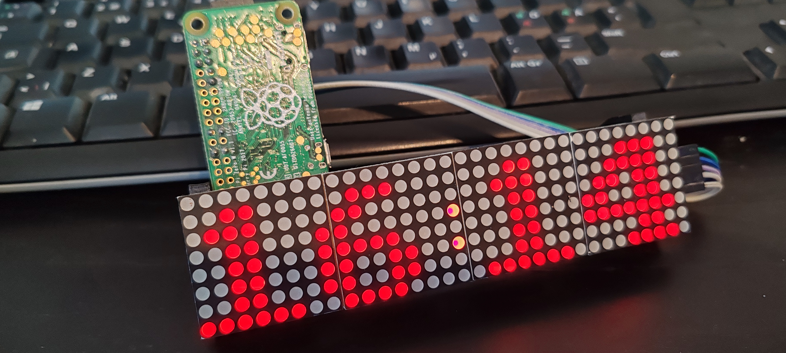

# Simple MAX7219 LED Matrix Clock

A very simple digital clock for a 4-module MAX7219 LED matrix.

This project is a simplified version of the `silly_clock.py` example
from [luma.led_matrix](https://github.com/rm-hull/luma.led_matrix).

I only needed the clock functionality, so I removed the features
that were unnecessary for my project. 🙂

## Original

Original example:

https://github.com/rm-hull/luma.led_matrix/blob/main/examples/silly_clock.py

Original project:

https://github.com/rm-hull/luma.led_matrix

The original project was created by Richard Hull and contributors.
Thanks for the excellent `luma.led_matrix` library!

## What is different?

The original example was simplified to make a small standalone clock.

Basically:

> I only wanted the clock. So I removed everything else. 😄

The clock displays the current system time on a 4 × 8×8 MAX7219
LED matrix and flashes the `:` separator twice per second.

## Hardware

- Raspberry Pi Zero W
- 4 × 8×8 MAX7219 LED matrix modules
- SPI

## Requirements

- Python 3
- luma.led_matrix
- luma.core

Install with:

    pip3 install luma.led_matrix --break-system-packages

## License

This project contains code derived from the `silly_clock.py` example
from `luma.led_matrix`.

The original `luma.led_matrix` project is licensed under the MIT License.

The original copyright and license notice are retained in the source
distribution.

See the original project for the complete license:

https://github.com/rm-hull/luma.led_matrix
